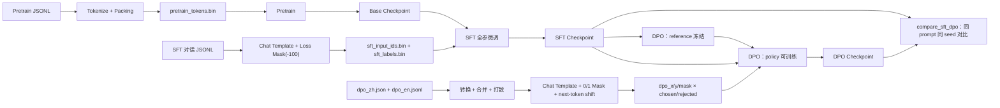
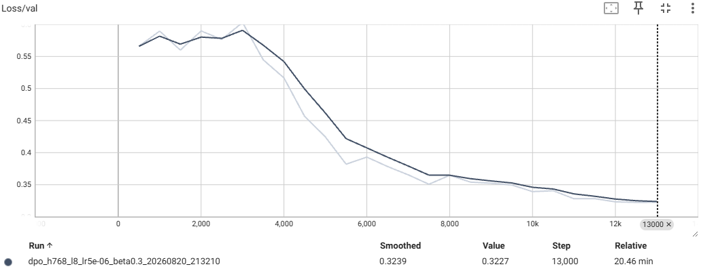
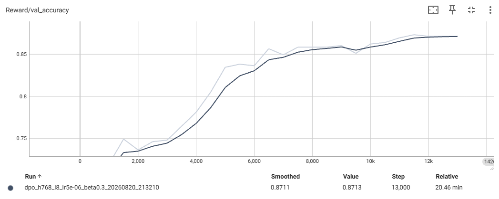

# 从 Pretrain 到 SFT 再到 DPO：MiniMind 小模型训练实践

这是一个以“真正走通大语言模型训练链路”为目标的学习型项目。目前 **Pretrain（预训练）→ SFT（监督微调）→ DPO（直接偏好优化）** 三个阶段的数据预处理、训练、评估脚本都已经实现并跑通，DPO 已经完成两轮完整的超参对比实验，第三轮正在进行。

本项目的重点不只是得到一个能生成文本的模型，更重要的是理解：原始数据如何变成训练目标、模型究竟在优化什么、训练异常如何定位，以及实验结论的可信边界在哪里。它适合用于个人复盘，也可作为小模型训练流程的实践参考。

> 当前状态：三阶段链路已全部跑通。DPO 的验证集 loss 与 reward 准确率有明显改善，但人工对比 SFT/DPO 的生成结果尚未看到质变（详见 [第 6 节](#6-dpo让模型学习偏好)）。项目仍属于学习与实验用途，不是生产级训练框架。

## 1. 阶段进度总览

| 阶段 | 状态 | 关键产物 | 目前的结论 |
| --- | --- | --- | --- |
| Pretrain | ✅ 完成 | `pretrain_tokens.bin` + base checkpoint | avg loss 3.1777 / PPL 23.99（训练集内抽样，无独立验证集） |
| SFT | ✅ 完成 | `sft_input_ids.bin` / `sft_labels.bin` + SFT checkpoint | loss 从 2.2 降到 1.4~1.8 后横盘；能对话，但幻觉、多轮弱、身份模板过拟合 |
| DPO | ✅ 已实现，调参中 | 6 个 `dpo_*.bin` + DPO checkpoint | 验证集 loss 0.688→0.32，RewardAcc 66%→87%；偏好确实学到了，但生成质量没有质变 |



## 2. 模型与训练配置

当前模型采用 MiniMind 的 Decoder-only Transformer 实现（RMSNorm + RoPE + GQA + SwiGLU FFN），默认配置如下：

| 配置 | 值 |
| --- | ---: |
| 词表大小 | 6,400 |
| Hidden size | 768 |
| Transformer 层数 | 8 |
| Attention heads / KV heads | 8 / 4（GQA） |
| head_dim | 96 |
| FFN intermediate size | 2,432 |
| 词嵌入与 lm_head | 权重共享（`tie_word_embeddings=True`） |
| 模型规模 | 约 63.9M 参数 |
| MoE | 关闭，使用 Dense FFN |

各阶段的训练超参（以仓库中 `core/*.sh` 的实际实验记录为准）：

| 阶段 | 训练样本形态 | seq_len | 学习率 | 有效 batch | epochs | 验证集 | 保留 ckpt |
| --- | --- | ---: | ---: | ---: | ---: | --- | ---: |
| Pretrain | packing 连续 token 流 | 2,048（模型输入 2,047） | 5e-4 | 48 | 2 | 无（复用训练数据，抽 200 个 batch 算 PPL） | 1 |
| SFT | 单条对话 pad 到定长 | 2,048 | 2e-5 | 32 | 3 | 无 | 1 |
| DPO | chosen/rejected 成对 | 768（shift 后存 767） | 4e-8 → 5e-6 → 5e-7（三轮实验） | 16 | 1~2 | 随机切 2%，每 500 step 评估 | 3 |

三个阶段共用的训练实现：混合精度（AMP + GradScaler）、梯度累积、梯度裁剪（1.0）、AdamW、warmup + cosine decay、TensorBoard 记录、checkpoint 滚动保留、固定随机种子。

> 说明：三个 `train_*.py` 各自用 argparse 定义命令行参数（互不依赖），`core/config.py` 提供项目路径常量、loguru 日志配置以及各阶段的 dataclass 配置模板，预处理脚本从它读取 `data/raw`、`data/processed`、`model/` 等路径。

## 3. 仓库结构

```text
train_llm/
├── core/                       # 数据预处理、三阶段训练与评估
│   ├── config.py               # 路径常量 / dataclass 配置 / 日志
│   ├── preprocess_pretrain.py  # JSONL → packing token 流 .bin
│   ├── train_pretrain.py
│   ├── evaluate_pretrain.py    # PPL 评估（被 train_pretrain 调用）
│   ├── preprocess_sft.py       # 对话 → input_ids/labels(-100) .bin
│   ├── train_sft.py            # 需要 --pretrain_ckpt
│   ├── evaluate_sft.py         # 定性生成检查（贪心/采样 + repetition_penalty）
│   ├── preprocess_dpo.py       # chosen/rejected → x/y/0-1 mask .bin
│   ├── train_dpo.py            # 需要 --sft_ckpt，policy + 冻结 reference
│   ├── compare_sft_dpo.py      # 同 prompt、同 seed 对比 SFT 与 DPO 生成
│   └── *.sh                    # Linux/CUDA 启动示例（含机器相关绝对路径）
├── model/                      # MiniMind、LoRA 与 tokenizer
├── test/                       # 数据诊断脚本与检查 notebook
│   ├── check_json.ipynb / check_sft_bin.ipynb
│   ├── diagnose_think_duplication.py   # 孤立 </think> 重复结构三层排查
│   ├── check_dpo_data.py               # DPO 语言构成 + token 长度画像
│   ├── convert_and_merge_dpo.py        # dpo_zh.json → 统一格式并与英文合并打散
│   ├── check_dpo_data_max_len.py       # 抽查全零 mask 样本的截断位置
│   └── check_dpo_data.ipynb            # 抽查 chosen/rejected 区分度
├── docs/                       # 原理、故障排查、实验结果与图片
├── data/                       # 原始/预处理数据，不提交 Git
├── checkpoints/                # 模型权重，不提交 Git
└── runs/                       # TensorBoard 日志，不提交 Git
```

推荐按以下顺序阅读 `docs/`：

1. [Pretrain 数据预处理](docs/PreTrain预处理数据.md)
2. [Pretrain 故障排查](docs/PreTrain故障排除.md)
3. [Pretrain 评估](docs/Pretrain评估.md)
4. [SFT 数据预处理](docs/SFT预处理数据.md)
5. [SFT 故障排查](docs/SFT故障排除.md)
6. [SFT 评估与生成分析](docs/SFT评估.md)
7. [DPO 数据预处理](docs/DPO数据预处理.md)
8. [DPO 训练结果评估](docs/DPO评估.md)

> `docs/` 用 Obsidian 编写，图片引用是 `![[xxx.png]]` 的 wiki 语法，在 GitHub 上不会渲染，直接看 [`docs/images/`](docs/images) 即可。

## 4. 快速开始

无包管理清单，请在独立的 Conda/venv 环境里安装脚本用到的依赖：PyTorch、Transformers、NumPy、tokenizers、tqdm、rich、loguru、TensorBoard。所有命令都从仓库根目录执行。

```bash
# 0) 原始数据放到 data/raw/
#    pretrain_t2t_mini.jsonl、sft_t2t_mini.jsonl、dpo_en.jsonl、dpo_zh.json

# 1) Pretrain
python core/preprocess_pretrain.py
python core/train_pretrain.py --epochs 2 --lr 5e-4 --effective_batch_size 48 --max_eval_batches 200

# 2) SFT
python core/preprocess_sft.py
python core/train_sft.py --pretrain_ckpt checkpoints/pretrain_..._final.pth --epochs 3 --lr 2e-5
python core/evaluate_sft.py --ckpt checkpoints/sft_..._final.pth --repetition_penalty 1.2
python core/evaluate_sft.py --ckpt checkpoints/sft_..._final.pth --greedy   # 可复现的贪心解码对照

# 3) DPO
python test/check_dpo_data.py           # 先给数据做语言构成 + 长度分布画像
python test/convert_and_merge_dpo.py    # dpo_zh.json + dpo_en.jsonl → dpo.jsonl（固定 seed 打散）
python core/preprocess_dpo.py           # → 6 个 dpo_*.bin + dpo_meta.json
python test/check_dpo_data_max_len.py   # 抽查全零 mask 样本被截断在哪里
python core/train_dpo.py --sft_ckpt checkpoints/sft_..._final.pth --lr 5e-7 --beta 0.3 --epochs 2
python core/compare_sft_dpo.py \
    --sft_ckpt checkpoints/sft_..._final.pth \
    --dpo_ckpt checkpoints/dpo_..._final.pth

# 训练过程监控
tensorboard --logdir runs
```

`core/*.sh` 是 Linux/CUDA 下的启动示例，里面写死了机器相关的绝对路径（包括具体的 checkpoint 文件名），复用前请先改路径。

## 5. Pretrain 与 SFT 回顾

### 5.1 Pretrain：让模型学习下一个 Token

Pretrain 原始数据是每行一个 `{"text": "..."}` 的 JSONL。预处理把所有文本 tokenize 后拼成连续 token 流，再按 `seq_len=2048` 切分。相较逐条 padding，packing 减少了无效位置和训练时的重复 tokenize 开销。

已记录的数据规模：

- 原始数据：1,270,238 行，329,954,848 tokens
- 有效数据：329,953,280 tokens（尾部不足一条序列的部分丢弃）
- 训练序列：161,110 条
- 二进制格式：`uint16`，约 629 MiB

`PretrainDataset` 用 `numpy.memmap` 按需读取，并构造错位一位的 `input_ids` 与 `labels`，训练模型预测下一个 token。

最终记录的平均 loss 为 **3.1777**，PPL 为 **23.99**。这个结果只能作为训练内参考：评估复用了训练数据、没有独立验证集；而且结果文件里的 `eval_tokens` 写的是全量数据规模，实际评估受 `--max_eval_batches 200` 限制（这一项仍在待修清单里）。

### 5.2 SFT：让模型学习如何回答

SFT 数据由多轮 `conversations` 构成，可选字段 `reasoning_content` 由 tokenizer 的 Chat Template 原生处理。没有真实推理内容时，预处理会精确删除空的 `<think>...</think>` 块；存在真实推理时则完整保留。

SFT 与 Pretrain 最关键的区别是 **Loss Mask**：

```text
user / system / padding token  -> label = -100，不计算 loss
assistant 回复 token          -> label = token id，计算 loss
```

为了兼顾正确性与磁盘空间：

- `input_ids` 使用 `uint16`；
- 包含 `-100` 的 `labels` 使用 `int16`；
- dtype 与文件名写入 `sft_meta.json`，训练端动态读取，避免读写协议漂移；
- 无有效 assistant label 的样本比例超过 5% 时，预处理直接中断。

训练从 Pretrain checkpoint 严格加载同构模型权重（`strict=True`），再做全参数微调。当前实验使用约 905,718 条对话、3 epochs、学习率 `2e-5`、有效 batch size 32。Loss 在前约 100k steps 从 2.2 快速下降至 1.5–1.7，随后主要在 1.4–1.8 区间震荡。

人工定性检查（贪心 vs 采样两轮对照）暴露出的四类问题，成为后续 DPO 的直接动机：机械复读、知识类幻觉、多轮上下文失效、答非所问退化成身份模板；此外还有一个稳定复现的畸形结构：内容说一遍 → 孤立 `</think>` → 同一段内容再说一遍。`test/diagnose_think_duplication.py` 用三层排查（原始数据重合度 → 模板渲染 → `.bin` 里真实写入的目标）确认它来自训练数据中的少量身份类样本，不是解码噪声。

## 6. DPO：让模型学习偏好

### 6.1 数据补全：先给数据做画像，再定协议

`test/check_dpo_data.py` 先做语言构成与长度画像，结果直接改变了后续方案：

| 语料 | 中文为主 | 英文为主 | 中英混合 |
| --- | ---: | ---: | ---: |
| 原始 DPO（17,166 行，抽样 5,000） | 0.0% | 100.0% | 0.0% |
| 对照：Pretrain 语料 | 88.6% | 2.9% | 8.5% |
| 对照：SFT 语料 | 100.0% | 0.0% | 0.0% |

也就是说，原始偏好数据和模型的语言底子完全错配。于是用 `test/convert_and_merge_dpo.py` 把中文 `dpo_zh.json`（`from`/`value` 字段、chosen/rejected 是单独对象）转换成与英文一致的结构（`role`/`content` 字段、chosen/rejected 各自是完整对话数组），合并后固定 `seed=42` 打散，得到 27,165 行的中英混合数据集：中文 60.6% / 英文 33.2% / 混合 6.2%。

合并后的 token 长度分布（chosen 侧）：均值 490 / P50 453 / P90 882 / P99 1,367 / max 4,198。据此选择 `max_seq_len=768`——尽量少截断，又不超出显存。

### 6.2 预处理：复用 SFT 的经验，但换一种 mask

`core/preprocess_dpo.py` 与 SFT 阶段共享的部分：assistant marker 从 `tokenizer.bos_token/eos_token` 动态生成（不手写字符串）、空 think 块精确剔除、预处理阶段就做防御性检查。差异在于：

1. **mask 形态不同**：SFT 产出 `-100`/真实 token id 的 labels，DPO 产出 `0/1` 掩码，用 `uint8` 存（比 `int16` 更省，因为不需要负数哨兵）。
2. **截断样本不清零**：768 长度下有些样本找不到结束 marker，此时 mask 一直标到序列末尾——截断只丢了结尾一小段，保留下来的前半段依然是有效训练信号，不该因为没匹配到 `<|im_end|>` 就把整段作废。
3. **预处理阶段就做 next-token shift**：`x = input_ids[:-1]`、`y = input_ids[1:]`，mask 同步右移对齐，因此落盘的序列长度是 **767** 而不是 768，这个值写进 `dpo_meta.json` 由训练端读取。
4. **防御性阈值**：chosen 或 rejected 任一侧出现全零 mask 就计数，占比超过 5% 直接 raise。实际结果是 494 / 27,165 ≈ 1.8%，低于阈值放行；`test/check_dpo_data_max_len.py` 用来抽查这些样本到底被截在哪里。

产物是 6 个 bin（`x`/`y`/`mask` × `chosen`/`rejected`）加一份 `dpo_meta.json`（记录 count、shift 后 seq_len、两种 dtype、全零 mask 数量、文件名映射）。

### 6.3 训练：policy 学、reference 只当尺子

`core/train_dpo.py` 的核心实现：

```text
L_DPO = -log σ( β · [ (logπ_policy(y_w|x) - logπ_ref(y_w|x))
                    - (logπ_policy(y_l|x) - logπ_ref(y_l|x)) ] )
```

- **两份权重同源**：policy 与 reference 都从同一个 SFT checkpoint 严格加载；reference 用 `copy.deepcopy` 复制，再 `eval()` + `requires_grad_(False)` 冻结，确保 policy 更新时不会顺带改动 reference（共享引用会让整个 DPO 机制失效）。
- **序列 log-prob**：`log_softmax` → 按真实 token `gather` → 乘 mask → 沿 seq 维求和，只累加 assistant 区间，prompt 部分不计入。
- **监控指标**：除了 `Loss/train_step`、`LR`，还记录 `Reward/chosen`、`Reward/rejected` 两个隐式奖励，以及核心观测量 `Reward/accuracy`（batch 内 chosen 奖励 > rejected 奖励的比例）。
- **补上 SFT 阶段缺的基础设施**：按 `--val_ratio 0.02` 随机切验证集，每 `--eval_every` 步跑一次 `Loss/val` 与 `Reward/val_accuracy`；`--keep_last_n_ckpt 3`（SFT 阶段设成 1，事后无法回溯对比）。

### 6.4 实验结果

| 指标 | 实验 1（lr=4e-8, beta=0.1） | 实验 2（lr=5e-6, beta=0.3） | 变化 |
| --- | ---: | ---: | --- |
| `loss/val`（step 500） | 0.688 | 0.566 | 起点更低 |
| `loss/val`（step 13000） | 0.6214 | 0.3227 | 收敛更低，几乎减半 |
| `Reward/val_acc`（step 500） | 66.3% | 69.6% | 起点更高 |
| `Reward/val_acc`（step 13000） | 68.87% | 87.13% | 提升约 18 个百分点 |

实验 1 的验证集 loss 从 500 → 13000 步单调下降并在 13000 步附近趋稳，RewardAcc 从 66.3% 爬到 68.7% 后稳定——50% 是随机瞎猜的基线，稳定高于基线说明 policy 确实在验证集（训练时没见过的数据）上学到了可泛化的偏好倾向，而不是死记硬背。实验 2 把学习率放大到 5e-6、beta 调到 0.3 后，两个指标同时大幅改善。

实验 2 的验证集曲线：

| 验证集 Loss | 验证集 Reward 准确率 |
| --- | --- |
|  |  |

实验 1 的对应曲线见 [`DPO_Loss_val_lr_4e-8_beta_0.1.png`](docs/images/DPO_Loss_val_lr_4e-8_beta_0.1.png) 与 [`DPO_Reward_val_acc_lr_4e-8_beta_0.1.png`](docs/images/DPO_Reward_val_acc_lr_4e-8_beta_0.1.png)。

**实验 3（进行中）**：从实验 1 与实验 2 的几何中点出发，保持 `beta=0.3`，学习率回退到 `5e-7`，`epochs=2`，结果待记录（`core/train_dpo.sh` 里保留了完整的参数变更记录）。

### 6.5 结论：指标变好 ≠ 回答变好

`core/compare_sft_dpo.py` 用同一批 prompt、同一套解码参数、每次生成前重置同一个 seed 对比 SFT 与 DPO，覆盖的正是之前诊断记录过的具体失败案例（答非所问退化成身份模板、多轮“炖多久”、孤立 `</think>` 重复结构、知识类问题），并额外加了一组**有标准答案的事实探针**（地球是行星还是恒星、光合作用是合成还是分解、3+5、是否编造与真实企业的关联）。

对比后的判断是：

- 实验 1（lr=4e-8）几乎学不动，SFT 与 DPO 的输出没有实质差别；
- 实验 2（lr=5e-6, beta=0.3）虽然 RewardAcc 涨了 18 个百分点，但生成质量的改善并不成立，而且出现了**更隐蔽的退化**：模型从“不回答/含糊回答”变成了“自信满满地说错”，错误更难被发现；
- 多轮对话理解没有改善；
- 这正是加事实探针的原因——偏好指标只衡量“chosen/rejected 排序对不对”，不衡量“内容本身对不对”。

**核心认知**：DPO 不会给模型注入新知识，它只调整模型在已有能力范围内的选择倾向。当前 64M 参数、6,400 词表的容量下，知识性缺陷不是 DPO 能解决的问题。

下一步方向：继续在 `lr`/`beta` 上做受控实验（实验 3）、清洗 DPO 数据（`test/check_dpo_data.ipynb` 已经在抽查 chosen/rejected 的区分度是否足够，比如大量“翻译任务 + 语气浮夸的 rejected”这类样本能提供的信号有限），以及换用训练强度不同的 SFT checkpoint 作为 DPO 起点做对照。

## 7. 三阶段数据协议对照

| 维度 | Pretrain | SFT | DPO |
| --- | --- | --- | --- |
| 样本形态 | packing 连续 token 流 | 单条对话 pad 到定长 | chosen/rejected 成对 |
| 训练目标 | 全部 token 预测下一个 | 只对 assistant 区间算 CE | 成对偏好比较，无 CE |
| 目标存储 | 单个 1D `uint16` token 流 | `input_ids`(uint16) + `labels`(int16, `-100`) | `x`/`y`(uint16) + `mask`(uint8, 0/1) |
| shift 时机 | Dataset 里错位取 | Dataset 里直接喂 labels | 预处理阶段就 shift（存 767） |
| 超长样本 | 拼流不存在超长 | 整条跳过 | 截断保留，mask 标到末尾 |
| 元信息 | `pretrain_config.json` | `sft_meta.json` | `dpo_meta.json` |
| 防御检查 | — | 全 `-100` 样本占比 > 5% 中断 | 任一侧全零 mask 占比 > 5% 中断 |
| 验证集 | 无 | 无 | 有（2%，训练中定期评估） |

## 8. 最重要的故障与经验

| 现象 | 根因 | 最终原则 |
| --- | --- | --- |
| `mmap length is greater than file size` | 写入端保存 `"<class 'numpy.uint16'>"`，读取端期待 `"uint16"` | 序列化 dtype 使用 `dtype.__name__` |
| `json.load` 报字符串无 `read` | 把单行字符串传给了读取文件对象的 API | JSONL 单行解析使用 `json.loads` |
| `-100 out of bounds for uint16` | label 哨兵值与无符号 dtype 冲突 | input 与 label 按真实值域选择 dtype |
| `loss=None` / logits 异常 | 将 labels 作为位置参数传到了 `attention_mask` | 关键参数使用 `labels=labels` 显式传递 |
| SFT 从第一步开始 `loss=nan` | 手写的 assistant marker 与真实 ChatML 不一致，labels 全为 `-100` | 特殊 token 从 tokenizer 动态获取，并检查有效 label 比例 |
| 孤立 `</think>` 后重复答案 | 少量训练样本中 reasoning 与答案高度重合 | 用原始数据、模板渲染、二进制目标三层排查 |
| DPO 数据 100% 英文，与中文底子错配 | 换阶段时没先核对数据的语言分布 | 新阶段数据先做语言/长度画像，再定 `max_seq_len` 与语料配比 |
| 截断样本 mask 匹配不到结束 marker | 768 截断把 `<|im_end|>` 截掉了 | 找不到结束符就标到末尾，保留前半段信号；同时用全零 mask 占比设阈值兜底 |
| RewardAcc 68.9% → 87.1%，但人工对比几乎没变好 | 偏好指标只衡量排序，不衡量内容正确性 | 必须配一组有标准答案的事实探针，指标涨了也要肉眼核对 |
| lr=4e-8 学不动，lr=5e-6 变成“自信地胡说” | DPO 对 `lr`/`beta` 极其敏感 | 用几何中点回退（5e-7 + beta 0.3）做受控实验，并冻结 prompt/seed/解码参数 |

这些问题共同说明：**训练能启动不等于数据正确，训练不报错不等于目标正确，指标变好也不等于行为变好。** 对 `.bin`、dtype、特殊 token、mask 这类跨模块协议，应建立单一真源，并用最小样例和统计阈值主动验证；对训练指标，则必须配套固定的定性检查。

## 9. 当前模型能力与边界

综合 SFT 与 DPO 两个阶段的人工评估，当前模型：

- 能按 ChatML 格式对话，采样 + repetition penalty 能缓解机械复读，但不能补足知识；
- 知识类问题存在语句通顺但事实错误的幻觉，DPO 之后错误反而更“自信”；
- 多轮上下文理解依然薄弱，DPO 没有改善；
- 身份类模板存在过拟合，可能在无关问题上答非所问；
- 部分异常 `<think>` 结构来自真实训练数据，而非单纯解码噪声。

方法论上的已知缺口：Pretrain/SFT 仍然没有独立验证集（DPO 已补上）、SFT 只留了一个 checkpoint 因此无法做分阶段对比、SFT/DPO 的对比还停留在人工逐条判断而没有量化的胜率/停止率/重复率指标、没有自动化测试与锁定版本的依赖文件。因此不能仅凭 train loss 横盘判断模型已收敛，也不能可靠地选择最佳 checkpoint。

## 10. 下一步工程清单

DPO 阶段已经补上的（SFT 阶段的教训）：

- [x] 训练中切分验证集并定期评估（`--val_ratio` / `--eval_every`）
- [x] 保留多个 checkpoint（`--keep_last_n_ckpt 3`）
- [x] 固定 prompt、固定 seed 的 SFT/DPO 对比脚本
- [x] 带标准答案的事实核查探针，防止只看指标误判

仍待办：

- [ ] 增加 `requirements.txt` 或 Conda 环境文件
- [ ] 为 Pretrain/SFT 也切固定验证集（至少用 held-out 数据重算一次指标）
- [ ] 修正 Pretrain 的 `eval_tokens` 统计（当前写全量，实际受 `--max_eval_batches` 限制）
- [ ] 统一 `--eval_every` 的步数语义（当前按 micro step 计，与 help 里写的 optimizer step 不一致）
- [ ] 补齐 DPO 实验 3（lr=5e-7, beta=0.3, epochs=2）的结果记录，并修正 `docs/DPO评估.md` 里 `0.87.13` 的笔误与脚本名（`convert_dpo_data.py` → `convert_and_merge_dpo.py`、`check_dpo_max_len.py` → `check_dpo_data_max_len.py`）
- [ ] 清洗 DPO 偏好数据：提升 chosen/rejected 的区分度，降低低信息量样本（翻译类、仅语气差异）的占比
- [ ] 用训练强度不同的 SFT checkpoint 作为 DPO 起点做对照实验
- [ ] 把人工对比升级为可量化评测：固定 prompt 集 + 胜率、正确停止率、重复率、事实正确率
- [ ] 为 tokenizer marker、loss mask、dtype 往返、DPO mask/shift 对齐增加单元测试
- [ ] 把 `core/*.sh` 里的绝对路径改成环境变量或相对路径

如果这个项目最终能沉淀下两条经验，那应该是：**先证明训练数据和目标函数表达了你真正想学的行为，再投入算力；以及，能被优化的指标和你真正想要的能力之间，永远需要一层人工校验。**
