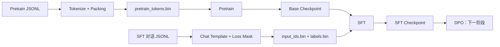

# 从 Pretrain 到 SFT：MiniMind 小模型训练实践

这是一个以“真正走通大语言模型训练链路”为目标的学习型项目。目前已经完成 **Pretrain（预训练）→ SFT（监督微调）**，下一阶段计划实现 **DPO（直接偏好优化）**。

本项目的重点不只是得到一个能生成文本的模型，更重要的是理解：原始数据如何变成训练目标、模型究竟在优化什么、训练异常如何定位，以及实验结论的可信边界在哪里。它适合用于个人复盘，也可作为小模型训练流程的实践参考。

> 当前状态：Pretrain 与 SFT 已跑通；DPO 尚未实现。项目仍属于学习与实验用途，不是生产级训练框架。

## 1. 项目全景



当前模型采用 MiniMind 的 Decoder-only Transformer 实现，默认配置如下：

| 配置 | 值 |
| --- | ---: |
| 词表大小 | 6,400 |
| Hidden size | 768 |
| Transformer 层数 | 8 |
| Attention heads | 8 |
| 训练序列长度 | 2,048 |
| 模型规模 | 约 63M 参数 |
| MoE | 关闭，使用 Dense FFN |

训练实现包括混合精度、梯度累积、梯度裁剪、AdamW、warmup + cosine decay、TensorBoard 记录和 checkpoint 滚动保留。

## 2. 仓库结构

```text
train_llm/
├── core/                       # 数据预处理、Pretrain/SFT 训练与评估
│   ├── preprocess_pretrain.py
│   ├── train_pretrain.py
│   ├── preprocess_sft.py
│   ├── train_sft.py
│   └── evaluate_sft.py
├── model/                      # MiniMind、LoRA 与 tokenizer
├── test/                       # 数据诊断脚本和检查 notebook
├── docs/                       # 原理、故障排查、实验结果与图片
├── data/                       # 原始/预处理数据，不提交 Git
├── checkpoints/               # 模型权重，不提交 Git
└── runs/                       # TensorBoard 日志，不提交 Git
```

推荐按以下顺序阅读：

1. [Pretrain 数据预处理](docs/PreTrain预处理数据.md)
2. [Pretrain 故障排查](docs/PreTrain故障排除.md)
3. [Pretrain 评估](docs/Pretrain评估.md)
4. [SFT 数据预处理](docs/SFT预处理数据.md)
5. [SFT 故障排查](docs/SFT故障排除.md)
6. [SFT 评估与生成分析](docs/SFT评估.md)

## 3. Pretrain：让模型学习下一个 Token

### 数据处理

Pretrain 原始数据格式为每行一个 `{"text": "..."}` 的 JSONL 文件。预处理过程将所有文本 tokenize 后拼接为连续 token 流，再按 `seq_len=2048` 切分。相较于逐条 padding，Packing 能减少无效位置和训练时的重复 tokenize 开销。

已记录的数据规模：

- 原始数据：1,270,238 行，329,954,848 tokens
- 有效数据：329,953,280 tokens
- 训练序列：161,110 条
- 二进制格式：`uint16`，约 629 MiB

`PretrainDataset` 使用 `numpy.memmap` 按需读取二进制文件，并构造错位一位的 `input_ids` 与 `labels`，训练模型预测下一个 token。

### 已有结果

最终记录的平均 loss 为 **3.1777**，PPL 为 **23.99**。这个结果只能作为训练内参考：当前评估复用了训练数据，没有独立验证集；此外，结果文件中的 `eval_tokens` 写入的是全量数据规模，而代码实际可能受 `max_eval_batches` 限制。

## 4. SFT：让模型学习如何回答

SFT 数据由多轮 `conversations` 构成，可选字段 `reasoning_content` 由 tokenizer 的 Chat Template 原生处理。没有真实推理内容时，预处理会精确删除空的 `<think>...</think>` 块；存在真实推理时则完整保留。

SFT 与 Pretrain 最关键的区别是 **Loss Mask**：

```text
user / system / padding token  -> label = -100，不计算 loss
assistant 回复 token          -> label = token id，计算 loss
```

为了兼顾正确性与磁盘空间：

- `input_ids` 使用 `uint16`；
- 包含 `-100` 的 `labels` 使用 `int16`；
- dtype 与文件名写入 `sft_meta.json`，训练端动态读取，避免读写协议漂移；
- 无有效 assistant label 的样本比例超过 5% 时，预处理直接中断。

训练从 Pretrain checkpoint 严格加载同构模型权重，再进行全参数微调。当前实验使用约 905,718 条对话、3 epochs、学习率 `2e-5`、有效 batch size 32。Loss 在前约 100k steps 从 2.2 快速下降至 1.5–1.7，随后主要在该区间震荡。

## 5. 最重要的故障与经验

| 现象 | 根因 | 最终原则 |
| --- | --- | --- |
| `mmap length is greater than file size` | 写入端保存 `"<class 'numpy.uint16'>"`，读取端期待 `"uint16"` | 序列化 dtype 使用 `dtype.__name__` |
| `json.load` 报字符串无 `read` | 把单行字符串传给了读取文件对象的 API | JSONL 单行解析使用 `json.loads` |
| `-100 out of bounds for uint16` | label 哨兵值与无符号 dtype 冲突 | input 与 label 按真实值域选择 dtype |
| `loss=None` / logits 异常 | 将 labels 作为位置参数传到了 `attention_mask` | 关键参数使用 `labels=labels` 显式传递 |
| SFT 从第一步开始 `loss=nan` | 手写的 assistant marker 与真实 ChatML 不一致，labels 全为 `-100` | 特殊 token 从 tokenizer 动态获取，并检查有效 label 比例 |
| 孤立 `</think>` 后重复答案 | 少量训练样本中 reasoning 与答案高度重合 | 用原始数据、模板渲染、二进制目标三层排查 |

这些问题共同说明：**训练能启动不等于数据正确，训练不报错也不等于目标正确。** 对 `.bin`、dtype、特殊 token、mask 等跨模块协议，应建立单一真源，并用最小样例和统计阈值主动验证。

## 6. 当前模型能力与边界

人工对比贪心和采样解码后，当前 SFT 模型表现出：

- 采样与 repetition penalty 能缓解机械复读，但不能补足知识；
- 知识问题存在语句通顺但事实错误的幻觉；
- 多轮上下文理解较弱；
- 身份类模板存在过拟合，可能在无关问题上答非所问；
- 部分异常 `<think>` 结构来自真实训练数据，而非单纯解码噪声。

当前实验还缺少独立验证集、分阶段 checkpoint 对比、自动化测试和锁定版本的依赖文件。因此不能仅凭 train loss 横盘判断模型已经收敛，也不能可靠选择最佳 checkpoint。


## 7. DPO 下一阶段计划

DPO 的目标应限定为“改善行为偏好”，而不是“补充模型不知道的知识”。它有机会改善答非所问、身份模板过拟合、复读、格式错误和多轮相关性，但无法替代更好的 Pretrain 数据。

建议按以下顺序推进：

1. **冻结基线**：保留当前 SFT checkpoint、固定生成问题与解码参数。
2. **建立验证集**：覆盖正确停止、重复率、问题相关性、多轮理解、事实性与 `<think>` 格式。
3. **设计偏好数据**：同一 prompt 下提供 `chosen`/`rejected`，重点覆盖已经观察到的失败模式，避免只堆通用样本。
4. **先验证数据链路**：检查模板一致性、长度、chosen/rejected 差异、特殊 token 与异常重复。
5. **实现 DPO**：明确 policy/reference model、`beta`、序列 log-prob mask、checkpoint 与显存策略；先用小数据做过拟合测试。
6. **做受控对比**：使用同一批 prompt 对比 SFT 与 DPO，记录胜率、停止率、重复率、相关性和人工案例，而不是只看 DPO loss。

阶段完成标准不是“DPO 代码跑完”，而是：在固定验证集上，目标行为稳定优于 SFT 基线，同时没有明显损害语言流畅度和已有能力。

## 8. 下一步工程清单

- [ ] 增加 `requirements.txt` 或 Conda 环境文件
- [ ] 为 Pretrain/SFT 划分固定训练集与验证集
- [ ] 修正 Pretrain 实际 `eval_tokens` 统计
- [ ] 保存并比较多个 checkpoint
- [ ] 为 tokenizer marker、loss mask、dtype 往返增加单元测试
- [ ] 固化 SFT 基线生成结果与评价表
- [ ] 定义 DPO 数据 schema、训练脚本和评估协议

如果这个项目最终能沉淀下一条经验，那应该是：**先证明训练数据和目标函数表达了你真正想学的行为，再投入算力。**
