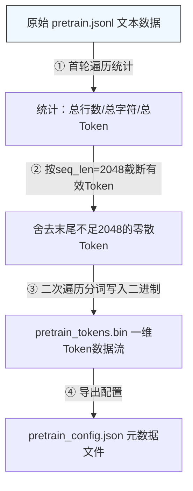

# LLM 预训练数据处理：从原始文本到二进制文件
## 1、核心思路
### 1.1、预处理
```text
不做预处理（每个epoch都需要tokenizer）：
    训练 epoch 1: 读文本 → tokenize → 训练
    训练 epoch 2: 读文本 → tokenize → 训练  ← 重复劳动
做预处理（只 tokenize 一次）:
  预处理阶段: 读文本 → tokenize → 存成 .bin
  训练 epoch 1: 直接读 .bin → 训练
  训练 epoch 2: 直接读 .bin → 训练  ← 零开销
```
核心思想就是：将CPU密集型的tokenize操作从训练循环中分离出来，只做一次，存成二进制文件，训练阶段直接读取二进制文件即可。

### Pakcing
```text
方案 A：每条数据 pad 到固定长度（之前用的方案）
  数据1: [1, 15, 234, 0, 0, 0]   ← 浪费了 3 个 pad 位置
  数据2: [1, 89, 0, 0, 0, 0]     ← 浪费了 4 个 pad 位置

方案 B：Packing（把所有数据连成一个长流，再切块）
  token 流: [1,15,234,89,1,567,890,...,2]
             ↓ 切成 max_seq_len=6
  序列1: [1, 15, 234, 89, 1, 567]   ← 没有浪费！
  序列2: [890, ..., 2, 1, 45, 67]
```
Packing 是把多个短文本拼接成一个连续 token 流，再按固定长度切块。这样 GPU 的计算资源不会被 pad token 浪费。

## 2、完整的数据流

## 3、详细信息
1. 第一遍扫描：统计信息

- 统计总行数、总字符数、总Token数
- 第一遍统计总的token数，第二遍利用memmap分配空间

2. 数据选择

```python
dtype = np.uint16 if vocab_size <= 65535 else np.uint32
```
选择理由：词表 6400 → uint16 足够（6400 < 65535），比 uint32 省一半磁盘空间。

3. Packing 实现
```python
# 所有 token 连成一条流
all_tokens = [token1, token2, ..., tokenN]  # 没有分隔符

# 切块
for i in range(0, len(all_tokens), max_seq_len):
    sequence = all_tokens[i:i+max_seq_len]
    # sequence 就是一条训练样本
```
关键：不需要手动切块，只需要把 token 流存成 .bin 文件。训练时用 reshape(N, max_seq_len) 自动切块。
```python
# 训练时读取
data = np.memmap("pretrain_tokens.bin", dtype=np.uint16, shape=(total_tokens,))
sequences = data.reshape(-1, max_seq_len)  # (num_sequences, max_seq_len)
```
4. 预训练不加BOS/EOS

预训练的目标是让模型学会语言模式，而不是句子边界。所以不浪费位置给 BOS/EOS。但是在微调阶段，BOS/EOS 还是需要的，需要让模型明确知道句子的边界位置。